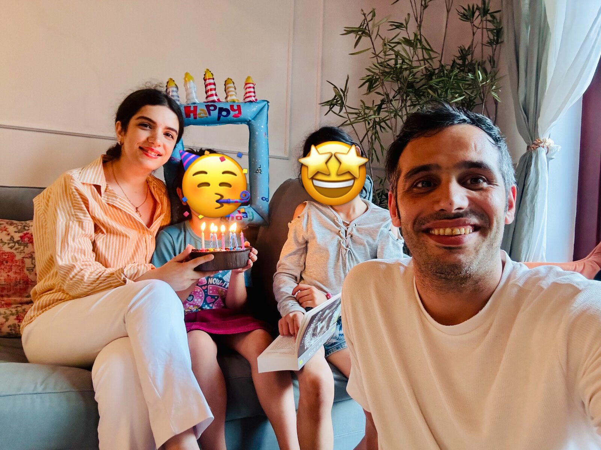

In an ideal world, this would be the hundred-and-something-th expertochange post. But the truth is, we don’t live in an ideal world.

## Today: a simple but complete day

On our career paths, many of us move between two important roles: leading in an organization and leading at home. That balance is not always easy, and sometimes a feeling of “not being enough” rises up in both roles, especially on important days like birthdays, wedding anniversaries, Nowruz and the rest.

Today, from the moment we woke up, we all fussed over the tiny hands and feet of our little finch. We took a few photos and sang birthday songs to her in Farsi and German, solo and all together.

In the afternoon we had ice cream together, then played at the playground near our home until she was the one who got tired.

In the evening we came back home and finished the celebration by blowing out the candles on the cake. A sleepover with Dad (*Übernachten*, as it’s called at home) was the last page of this dream of a day.

Partway through the day she said, “I couldn’t have wished for a better birthday,” so I asked which part she had liked best. Her answer was simple: “All of it was good.”

## What I took from it

In leadership, whether in an organization or in a family, impact starts with being present, not with being perfect. “Being enough” means making conscious choices and being truly present in the moments that matter.

The practical step I set for myself: from now on, I take our birthdays off work so we can spend real time together.

If you also swing between your professional role and being a parent, tell me about your experience, so we can learn from each other.
